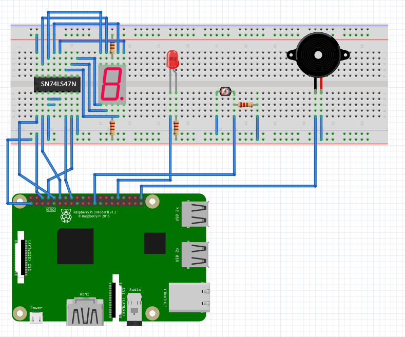

# 🌐 TCP/IP 기반 멀티스레드 원격 장치 제어 시스템

> **VEDA 심화 실습 평가 2 (리눅스 프로그래밍)**
> 본 프로젝트는 우분투 리눅스(Client)와 라즈베리파이 4(Server) 간의 TCP 소켓 통신을 이용한 비동기 임베디드 주변 장치 제어 시스템입니다.

---

## 1. 🚀 빌드 및 실행 방법

### 1) 서버 (라즈베리파이 4) 빌드 및 구동
프로젝트 루트 디렉터리에서 `make` 명령어를 통해 동적 공유 라이브러리(`.so`)와 서버 실행 파일을 한 번에 빌드합니다.

```bash
cd ~/LinuxProject
make
./exec/server
```

### 2) 클라이언트 (우분투 리눅스 PC) 빌드 및 실행

```bash
cd ~/LinuxProject
gcc -Wall -O2 -o exec/client code/client/client.c -lpthread
./exec/client [라즈베리파이_IP]
```

---

## 2. ✅ 평가 기준항목별 구현 기능 여부 (Checklist)

### 📌 [코드 완성도 - 구현 내용 (30점)]
- [v] **멀티 스레드 기반 장치 제어 구현** (`pthread` 기반 다중 클라이언트 및 센서/재생 제어 분리)
- [v] **동적 공유 라이브러리 기능 이용** (각 장치 제어 로직을 `lib*.so` 형태로 모듈화 완료)
- [v] **서버의 데몬(Daemon) 프로세스 형식 구성** (`daemon(0,0)`을 이용한 세션 분리 및 백그라운드 상시 구동)
- [v] **클라이언트 프로그램 시그널 예외 처리** (`SIGPIPE` 무시로 서버 다운 방지 및 `SIGTSTP` 오작동 차단)
- [v] **단, INT 신호(`Ctrl+C`)에만 안전하게 종료되도록 처리** (정상적인 자원/소켓 해제 루틴 매핑 완료)
- [v] **빌드 자동화 구현** (`make`를 통한 전체 모듈 컴파일 및 rpath 링크 자동화)

### 📌 [장치 제어 구현 기능 (각 10점, 총 40점)]
- [v] **LED 제어**: 클라이언트 명령 인터페이스 및 소프트웨어 PWM 기반 3단계 밝기 조절(최대/중간/최저) 구현
- [v] **부저 제어**: 독립 스레드를 통한 음악 소리 ON/OFF 제어 기능 구현
- [v] **조도 센서**: 백그라운드 모니터링 및 빛 감지 여부에 따른 LED 자동 연동 ON/OFF 제어 구현
- [v] **7세그먼트**: 클라이언트 전송 숫자(0~9) 표시, 1초 주기 카운트다운 감소 및 0 도달 시 부저 알람 자동 연동 구현

---

## 🛠️ 하드웨어 구성 및 회로도



---

## 📁 디렉터리 구조

```text
.
├── code
│   ├── buzzer    # 부저 제어 라이브러리 소스 (buzzer.c, buzzer.h)
│   ├── client    # 우분투 클라이언트 소스 (client.c)
│   ├── led       # LED 제어 라이브러리 소스 (led.c, led.h)
│   ├── segment   # 7세그먼트 카운트다운 라이브러리 소스 (segment.c, segment.h)
│   ├── sensor    # 조도센서 모니터링 라이브러리 소스 (sensor.c, sensor.h)
│   └── server    # 멀티스레드 데몬 서버 소스 (server.c)
├── docs          # 개발 문서 저장 경로
├── exec          # 빌드 결과물 최종 저장 경로
│   ├── client    # 클라이언트 실행 파일
│   ├── lib       # 동적 공유 라이브러리 (*.so) 저장 폴더
│   └── server    # 서버 데몬 실행 파일
└── Makefile      # 전체 프로젝트 빌드 자동화 스크립트
```

---

## 🎮 장치 제어 메뉴 구성

```text
[ Device Control Menu ]
1. LED ON          2. LED OFF          3. Set Brightness
4. BUZZER ON       5. BUZZER OFF       6. SENSOR ON
7. SENSOR OFF      8. SEGMENT DISPLAY  9. SEGMENT STOP
0. Exit
```
